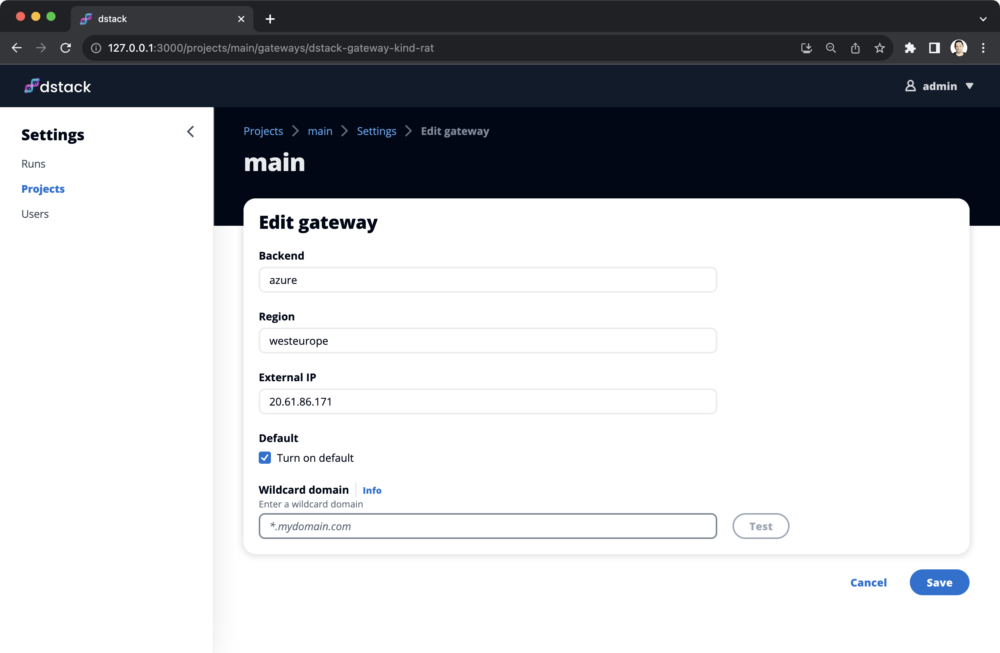

# Managed gateways for serving LLMs across clouds

__The dstack 0.11.1 update makes it easier to serve LLMs via public endpoints.__

Services is a preview feature that allows serving LLMs via public endpoints using multiple clouds
(AWS, GCP, Azure, Lambda, etc.) 
The latest update of `dstack` makes the use of services much easier by introducing default gateways and wildcard domains.

<!-- more -->

## Default gateways

Previously, to run a service, you had to create a gateway using the `dstack gateway create` command and pass its address via the `gateway` property in the service configuration file.

Now, you don't need to use the `gateway` property anymore, as you can create a gateway via the UI and mark it as default.

{ width=800 }

## Wildcard domain

Once the gateway is created (and assigned an external IP), you can set up an A record with your DNS provider to map `*.<your domain name>` to the gateway's IP and specify this wildcard domain in the gateway's settings.

{ width=800 }

If a wildcard domain is configured, dstack automatically enables HTTPS and runs services at `https://<run name>.<your domain name>`.

<div class="termy">

```shell
$ dstack run . -f text-generation-inference/serve.dstack.yml --gpu A100 -y

 RUN           BACKEND  INSTANCE              SPOT  PRICE STATUS    SUBMITTED
 tasty-zebra-1 lambda   200GB, 1xA100 (80GB)  no    $1.1  Submitted now
 
Privisioning...
---> 100%

Serving on https://tasty-zebra-1.mydomain.com
```

</div>


!!! info "Why this matters?"
    The gateway feature makes it very easy to serve LLMs using GPUs across multiple regions and cloud providers (AWS, GCP,
    Azure, Lambda, etc.), while providing convenient endpoints via HTTPS.

## Task scheduling

In other news, the update fixes a few bugs with the `--retry-limit` argument in `dstack run`. Now, it works again,
allowing you to schedule tasks even if there is no required capacity at the moment.

<div class="termy">

```shell
$ dstack run . -f llama-2/train.dstack.yml --gpu A100 --retry-limit 1h

 RUN           BACKEND  INSTANCE  SPOT  PRICE STATUS  SUBMITTED
 tasty-zebra-1          -         auto  -     Pending now
 
Waiting for capacity... To exit, press Ctrl+C.
```

</div>

Last but not least, we've updated the entire [documentation](https://dstack.ai/docs/) and [examples](https://dstack.ai/examples/).

## Give it a try

Getting started with `dstack` takes less than a minute. Go ahead and give it a try.

<div class="termy">

```shell
$ pip install "dstack[aws,gcp,azure,lambda]" -U
$ dstack start
```
</div>

!!! info "Feedback and support"
    Questions and requests for help are very much welcome in our 
    [Slack chat](https://join.slack.com/t/dstackai/shared_invite/zt-xdnsytie-D4qU9BvJP8vkbkHXdi6clQ).