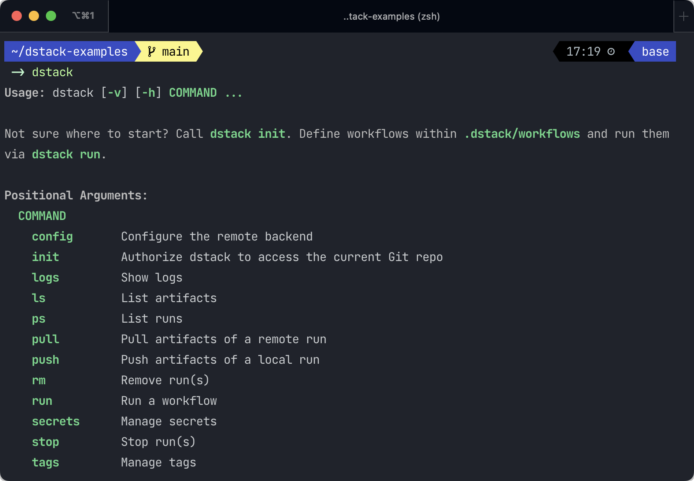

# How dstack works 

`dstack` allows YAML-defined ML pipelines to be run locally or remotely in any configured cloud accounts without
Kubernetes or custom Docker images via CLI.

Workflows can be scripts for data preparation or model training, web apps like Streamlit or Gradio, or development
environments like JupyterLab or VS Code.

!!! info "NOTE:"
    When running a workflow remotely (e.g. in a configured cloud account), `dstack` automatically creates and
    destroys instances based on resource requirements and cost strategy, such as using spot instances.

## Remotes

By default, workflows run locally. To run workflows remotely, you need to first configure a remote using the `dstack
config` command. Once a remote is configured, use the `--remote` flag with the `dstack run` command to run a workflow in
the remote.

!!! info "NOTE:"
    Currently, a remote can be an AWS or GCP account only. Support for Azure, and Hub[^1] are coming soon.

Remotes facilitate collaboration by allowing multiple team members to access the same remote, view each other's runs,
and reuse each other's artifacts.

## Workflows

Here's an example from the [Quick start](https://docs.dstack.ai/quick-start).

```yaml
workflows:
  - name: mnist-data
    provider: bash
    commands:
      - pip install torchvision
      - python mnist/mnist_data.py
    artifacts:
      - path: ./data

  - name: train-mnist
    provider: bash
    deps:
      - workflow: mnist-data
    commands:
      - pip install torchvision pytorch-lightning tensorboard
      - python mnist/train_mnist.py
    artifacts:
      - path: ./lightning_logs
```

YAML-defined workflows eliminate the need to modify code in your scripts, giving you the freedom to choose frameworks,
experiment trackers, and cloud providers.

!!! info "NOTE:"
    Workflows run in containers with pre-configured Conda environments, and CUDA drivers.

## Artifacts

Artifacts enable you to save any files produced by a workflow for later reuse in other workflows. They may include data,
model checkpoints, or even a pre-configured Conda environment.

When running a workflow locally, the artifacts are saved locally. To push the artifacts of a local to a configured remote,
use the `dstack push` command.

When running a workflow remotely, the artifacts are pushed to the remote automatically.

## CLI

The dstack CLI provides various functionalities such as running workflows, accessing logs, artifacts, and stopping
runs, among others.

 { width="800" }
 
## Why dstack?

`dstack` enables you to create ML pipelines that are independent of any particular vendor and run them effortlessly
from your preferred IDE.

Unlike end-to-end MLOps platforms, `dstack` is lightweight, developer-friendly, and designed to facilitate collaboration
without imposing any particular approach.

[^1]:
    Use the `dstack hub start --port PORT` command (coming soon) to host a web application that provides a UI for configuring cloud
    accounts and managing user tokens. Configure this hub as a remote for the CLI to enable the hub to act as a proxy
    between the CLI and the configured account. This setup offers improved security and collaboration.