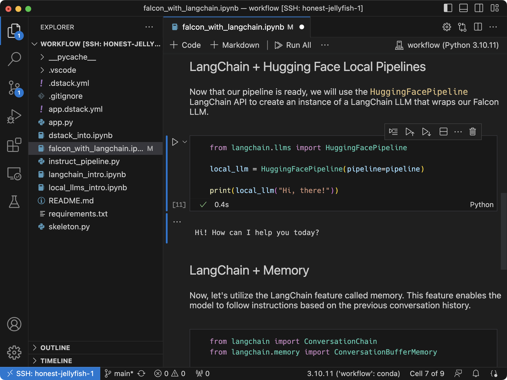

# Dev environments

Before submitting a long-running task or deploying a model, you may want to experiment 
interactively using your IDE, terminal, or Jupyter notebooks.

With `dstack`, you can provision a dev environment with the required cloud resources, 
code, and environment via a single command.

## Define a configuration

First, create a YAML file in your project folder. Its name must end with `.dstack.yml` (e.g. `.dstack.yml` or `dev.dstack.yml` are
both acceptable).

<div editor-title=".dstack.yml"> 

```yaml
type: dev-environment

python: "3.11" # (Optional) If not specified, your local version is used

ide: vscode
```

</div>

!!! info "Configuration options"
    You can specify your own Docker image, configure environment variables, etc.
    If no image is specified, `dstack` uses its own Docker image (pre-configured with Python, Conda, and essential CUDA drivers).
    For more details, refer to the [Reference](../reference/dstack.yml.md#dev-environment).

## Run the configuration

To run a configuration, use the `dstack run` command followed by the working directory path, 
configuration file path, and any other options (e.g., for requesting hardware resources).

<div class="termy">

```shell
$ dstack run . -f .dstack.yml --gpu A100

 BACKEND     REGION         RESOURCES                     SPOT  PRICE
 tensordock  unitedkingdom  10xCPU, 80GB, 1xA100 (80GB)   no    $1.595
 azure       westus3        24xCPU, 220GB, 1xA100 (80GB)  no    $3.673
 azure       westus2        24xCPU, 220GB, 1xA100 (80GB)  no    $3.673
 
Continue? [y/n]: y

Provisioning...
---> 100%

To open in VS Code Desktop, use this link:
  vscode://vscode-remote/ssh-remote+fast-moth-1/workflow
```

</div>

!!! info "Run options"
    The `dstack run` command allows you to use `--gpu` to request GPUs (e.g. `--gpu A100` or `--gpu 80GB` or `--gpu A100:4`, etc.),
    and many other options (incl. spot instances, disk size, max price, max duration, retry policy, etc.).
    For more details, refer to the [Reference](../reference/cli/index.md#dstack-run).

Once the dev environment is provisioned, click the link to open the environment in your desktop IDE.

{ width=800 }

!!! info "Port forwarding"
    When running a dev environment, `dstack` forwards the remote ports to `localhost` for secure 
    and convenient access.

No need to worry about copying code, setting up environment, IDE, etc. `dstack` handles it all 
automatically.

??? info ".gitignore"
    When running a dev environment, `dstack` uses the exact version of code from your project directory. 

    If there are large files, consider creating a `.gitignore` file to exclude them for better performance.

## What's next?

1. See all [learning materials](../../learn/index.md)
2. Check the [reference](../reference/dstack.yml.md#dev-environment)