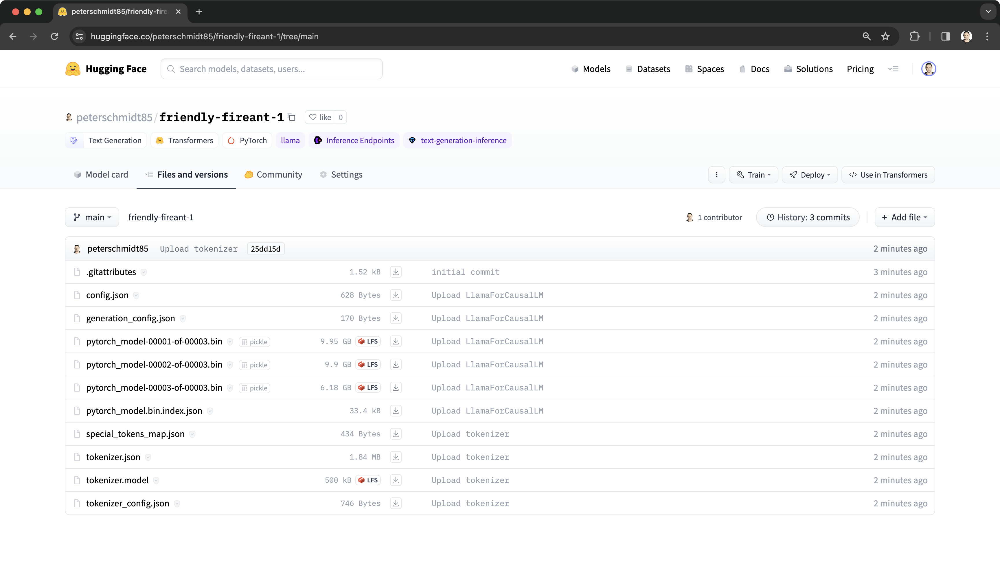

# Fine-tuning

For fine-tuning an LLM with `dstack`'s API, specify a model, dataset, training parameters,
and required compute resources. The API takes care of everything else.

??? info "Prerequisites"
    To use the fine-tuning API, ensure you have the latest version:

    <div class="termy">

    ```shell
    $ pip install "dstack[all]==0.12.3rc3"
    ```

    </div>

> The API currently supports only supervised fine-tuning (SFT). Support for DPO and RLHF is coming soon.

## Prepare a dataset

The dataset should contain a `"text"` column with completions following the prompt format
of the corresponding model. Check the [example](https://huggingface.co/datasets/peterschmidt85/samsum)
(for fine-tuning Llama 2).

> Once the dataset is prepared, it must be [uploaded](https://huggingface.co/docs/datasets/upload_dataset) to Hugging Face.

??? info "Uploading a dataset"
    Here's an example of how to upload a dataset programmatically:

    ```python
    import pandas as pd
    from datasets import Dataset

    df = pd.read_json("samsum.jsonl", lines=True)
    dataset = Dataset.from_pandas(df)
    dataset.push_to_hub("peterschmidt85/samsum")
    ```

## Create a client

First, you connect to `dstack`:

```python
from dstack.api import Client

client = Client.from_config()
```

## Create a task

Then, you create a fine-tuning task, specifying the model and dataset, 
and various [training parameters](../../docs/reference/api/python/index.md#dstack.api.FineTuningTask).

```python
from dstack.api import FineTuningTask

task = FineTuningTask(
    model_name="NousResearch/Llama-2-13b-hf",
    dataset_name="peterschmidt85/samsum",
    env={
        "HUGGING_FACE_HUB_TOKEN": "...",
    },
    num_train_epochs=2,
    max_seq_length=1024,
    per_device_train_batch_size=2,
)
```

## Run the task

When running a task, you can configure resources, and many [other options](../../docs/reference/api/python/index.md#dstack.api.RunCollection.submit).

```python
from dstack.api import Resources, GPU

run = client.runs.submit(
    run_name="Llama-2-13b-samsum", # (Optional) If unset, its chosen randomly
    configuration=task,
    resources=Resources(gpu=GPU(memory="24GB")),
)
```

!!! info "GPU memory"
    The API defaults to using QLoRA based on the provided 
    [training parameters](../../docs/reference/api/python/index.md#dstack.api.FineTuningTask).
    When specifying GPU memory, consider both the model size and the specified batch size.
    After a few attempts, you'll discover the best configuration.

When the training is done, the API pushes the final model to the Hugging Face hub.

{ width=800 }

## Manage runs

You can manage runs using [API](../../docs/reference/api/python/index.md#dstack.api.Client),
the [CLI](../../docs/reference/cli/index.md), or the user interface.

## Track metrics

To track experiment metrics, specify `report_to` and related authentication environment variables.

```python
task = FineTuningTask(
    model_name="NousResearch/Llama-2-13b-hf",
    dataset_name="peterschmidt85/samsum",
    report_to="wandb",
    env={
        "HUGGING_FACE_HUB_TOKEN": "...",
        "WANDB_API_KEY": "...",
    },
    num_train_epochs=2
)
```

Currently, the API supports `"tensorboard"` and `"wandb"`.

{ width=800 }

[//]: # (TODO: Examples - Llama 2, Mistral, etc)

## What's next?

- Once the model is trained, proceed to [deploy](text-generation.md) it as an endpoint.
  The deployed endpoint can be used from your apps directly or via LangChain.
- The source code of the fine-tuning task is available
  at [GitHub](https://github.com/dstackai/dstack/tree/master/src/dstack/api/_public/huggingface/finetuning/sft).
  If you prefer using a custom script, feel free to do so using [dev environments](dev-environments.md) and 
  [tasks](tasks.md).
