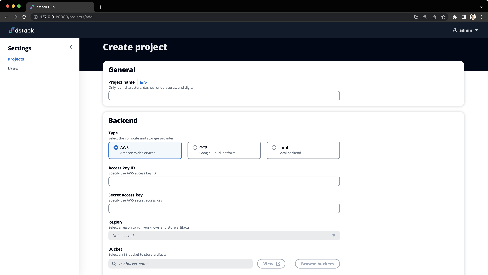

# Hub

Hub is a tool that helps you manage users, cloud credentials, and settings in one place. 

To use it, you can deploy the Hub application using Docker and then provide its URL and the user's personal token to the
`dstack config` command. 

This way, you don't need to store cloud credentials locally for every `dstack` user. Hub also offers more advanced management
of workflow execution.

## Start the server

The easiest way to start the Hub application server is by using Docker: 

<div class="termy">

```shell
$ docker run -p 3000:3000 \ 
  -v $(pwd)/hub:/root/.dstack/hub \
  dstackai/dstack

The hub is available at http://0.0.0.0:3000?token=b934d226-e24a-4eab-a284-eb92b353b10f
```

</div>

Once the server is up, visit the URL in the output to login as an administrator.

## Create a project

After you've logged in as an administrator, you can manage users and projects.
Go ahead and create a new project.

{ width=800 }

When creating a project, you must choose the type of backend (such as AWS or GCP), provide cloud credentials, and
specify additional settings, including the bucket to store artifacts, the region to run workflows, etc.

{ width=800 }

To enable multiple users to work on the same project, create those users and add them as members of the project.

## Configure the CLI

After creating the project, copy the `dstack config` command from the user interface and execute it in your
terminal to configure the project as a remote.

<div class="termy">

```shell
$ dstack config --url http://0.0.0.0:3000 \
  --project my-awesome-project \
  --token b934d226-e24a-4eab-a284-eb92b353b10f
```

</div>

That's it! You've configured Hub as a remote.